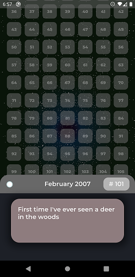

# LitStarfield

LitStarfield enables you to render an animated starfield to be used as a background for your parent widget.

Visit our [website](https://litlifesoftware.github.io) for more details.

Created and maintained by [LitLifeSoftware](https://www.instagram.com/litlifesw/) (Michael Grigorenko).

## Getting Started

To use the LitStarfield in your Flutter app make sure to import it by including the
code line `import 'package:lit_starfield/lit_starfield.dart';` in the header part of
your `.dart` file.

For help getting started with Flutter, view Flutter's
[online documentation](https://flutter.dev/docs), which offers tutorials,
samples, guidance on mobile development, and a full API reference.

## Apps built with LitStarfield

- [Remaining Lifetime](https://litlifesoftware.github.io/) by LitLifeSoftware - [Google Play](https://play.google.com/store/apps/details?id=com.litlifesoftware.remaining_lifetime)

> Visualize your entire life. Memorize your achievements and make every month count.

> 

## Example

Create a `LitStarfieldBackground` object in your parent widget to use it as your background.

```dart
import 'package:flutter/material.dart';
import 'package:lit_starfield/lit_starfield.dart';

void main() {
  runApp(MyApp());
}

class MyApp extends StatelessWidget {
  // This widget is the root of your application.
  @override
  Widget build(BuildContext context) {
    return MaterialApp(
      home: Scaffold(
        appBar: AppBar(
          backgroundColor: Colors.black,
          title: Center(
            child: Text(
              "Lit Starfield Demo",
              textAlign: TextAlign.center,
              style: TextStyle(
                color: Colors.white,
              ),
            ),
          ),
        ),
        body: LitStarfieldBackground(),
      ),
    );
  }
}
```

To get a better understanding for implementing LitStarfield's widgets we recommend
to take a look at the example app provided in the `example` folder. Feel free to
experiment with the UI.

## License

The source code is distributed under the **BSD 3-Clause** license as specified in the `LICENSE` file.
