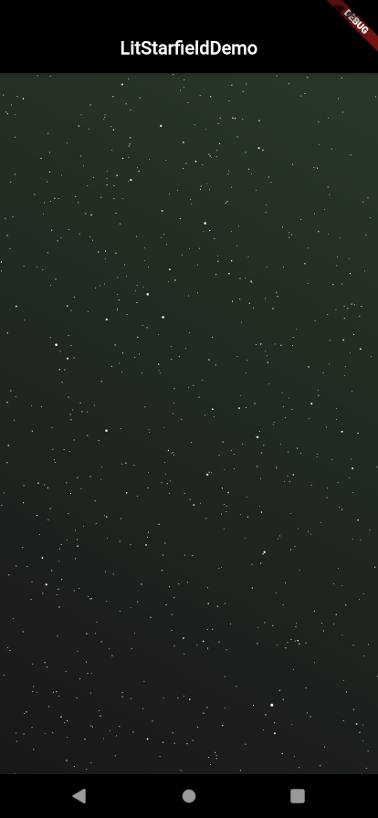
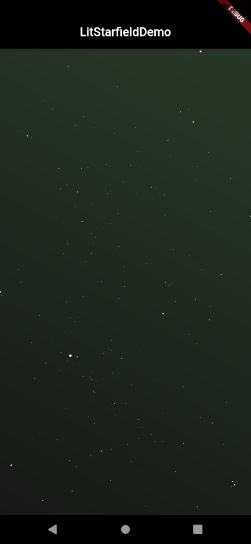
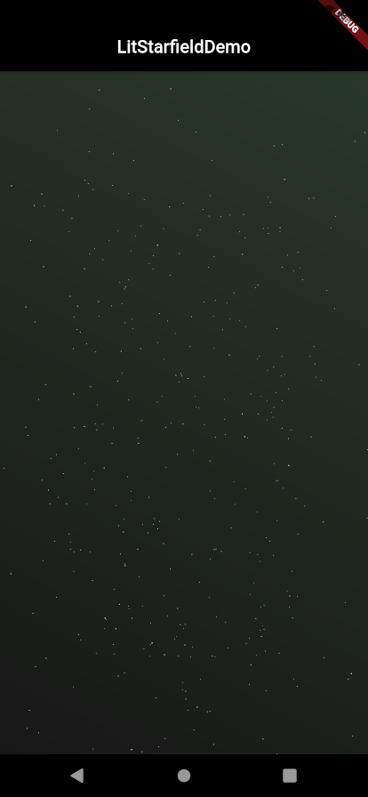

# LitStarfield

A Flutter plugin for rendering an animated starfield.

Visit our [website](https://litlifesoftware.github.io) for more details.

Created and maintained by [LitLifeSoftware](https://www.github.com/litlifesoftware/).

## Getting Started

To use the LitStarfield in your Flutter app make sure to import it by including the
code line `import 'package:lit_starfield/lit_starfield.dart';` in the header part of
your `.dart` file.

For help getting started with Flutter, view Flutter's
[online documentation](https://flutter.dev/docs), which offers tutorials,
samples, guidance on mobile development, and a full API reference.

## Screenshots

| #1                                                             | #2                                                             | #3                                                             |
| -------------------------------------------------------------- | -------------------------------------------------------------- | -------------------------------------------------------------- |
|  |  |  |

## Example

Create a `LitStarfieldContainer` instance in your parent widget to use it as your background.

```dart
import 'package:flutter/material.dart';
import 'package:lit_starfield/lit_starfield.dart';

void main() {
  runApp(MyApp());
}

class MyApp extends StatefulWidget {
  const MyApp({Key? key}) : super(key: key);

  @override
  _MyAppState createState() => _MyAppState();
}

class _MyAppState extends State<MyApp> {
  @override
  Widget build(BuildContext context) {
    return MaterialApp(
      home: _HomeScreen(),
    );
  }
}

class _HomeScreen extends StatelessWidget {
  const _HomeScreen({Key? key}) : super(key: key);

  @override
  Widget build(BuildContext context) {
    return Scaffold(
      appBar: AppBar(
        backgroundColor: Colors.black,
        title: Center(
          child: Text(
            "LitStarfieldDemo",
            textAlign: TextAlign.center,
            style: TextStyle(color: Colors.white),
          ),
        ),
      ),
      body: LitStarfieldImpl(),
    );
  }
}

class LitStarfieldImpl extends StatelessWidget {
  const LitStarfieldImpl({Key? key}) : super(key: key);

  @override
  Widget build(BuildContext context) {
    return LitStarfieldContainer();
  }
}
```

To get a better understanding for implementing LitStarfield's widgets we recommend
to take a look at the example app provided in the `example` folder. Feel free to
experiment with the UI.

## License

All images in the `assets/images` folder are licensed under the **CC-BY**.

The source code is distributed under the **BSD 3-Clause** license as specified in the `LICENSE` file.
